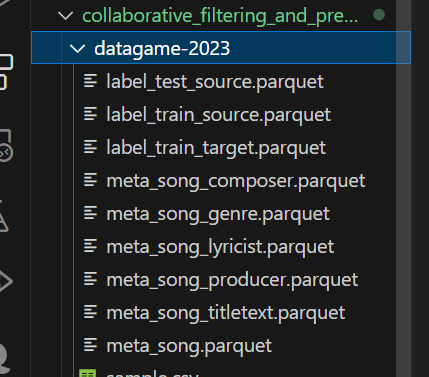

# KKcompanyCode
## Instructions
Run the code according to the following order to ensure correct files to be in place:
1. First of all, open the comparisonGenerator.ipynb file and execute to generate the file "same_df.csv"
2. Secondly, the mostPlayedDataGenerator.ipynb data is going to take the previously generated file "same_df.csv" to create two files "included_data.csv" and "excluded_data.csv"
3. Finally, our file "output_generating_project" is going to produce the final file for recommendations
## Pregenerated Data
The file Top5_excluded_test_datasets.csv is first created by finding the top five songs played in a session.
## Original Data needs to be imported
Due to the folder size constraint, we decide not to include our testing and training data here.

